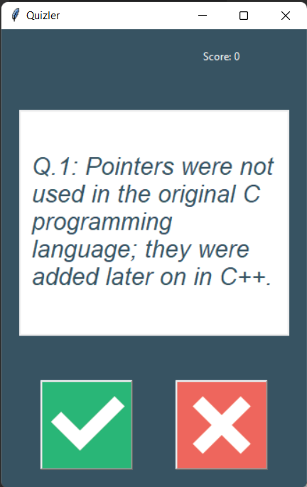

# **Trivia GUI Quiz Game**

A graphical user interface (GUI) quiz game that asks a series of true/false questions and keeps track of the user's score.

## **Table of Contents**

- **[Technologies](https://chat.openai.com/?model=text-davinci-002-render-sha#technologies)**
- **[Setup](https://chat.openai.com/?model=text-davinci-002-render-sha#setup)**
- **[Usage](https://chat.openai.com/?model=text-davinci-002-render-sha#usage)**
- **[Screenshots](https://chat.openai.com/?model=text-davinci-002-render-sha#screenshots)**
- **[Contributing](https://chat.openai.com/?model=text-davinci-002-render-sha#contributing)**
- **[License](https://chat.openai.com/?model=text-davinci-002-render-sha#license)**

## **Technologies**

- Python 3
- Tkinter (for GUI)
- Open Trivia Database API (for quiz questions)

## **Setup**

1. Clone the repository to your local machine.
2. Install the required packages using pip: **`pip install -r requirements.txt`**
3. Run the main script: **`python main.py`**

Note: You will need an active internet connection to run this app as it uses an API to fetch the quiz questions.

## **Usage**

- Launch the app by running the **`main.py`** file in your Python environment.
- Click on the "True" or "False" buttons to answer each question.
- The app will display whether your answer was correct or incorrect.
- After answering all questions, the app will display your final score.

## **Screenshots**

## **Contributing**

Contributions to this project are welcome! To contribute, follow these steps:

1. Fork this repository.
2. Create a new branch with your feature or bug fix: **`git checkout -b my-feature-branch`**.
3. Make changes and commit them: **`git commit -am 'Add new feature'`**.
4. Push to the branch: **`git push origin my-feature-branch`**.
5. Submit a pull request.

## **License**

This project is licensed under the MIT License. See the **`LICENSE`** file for details.
